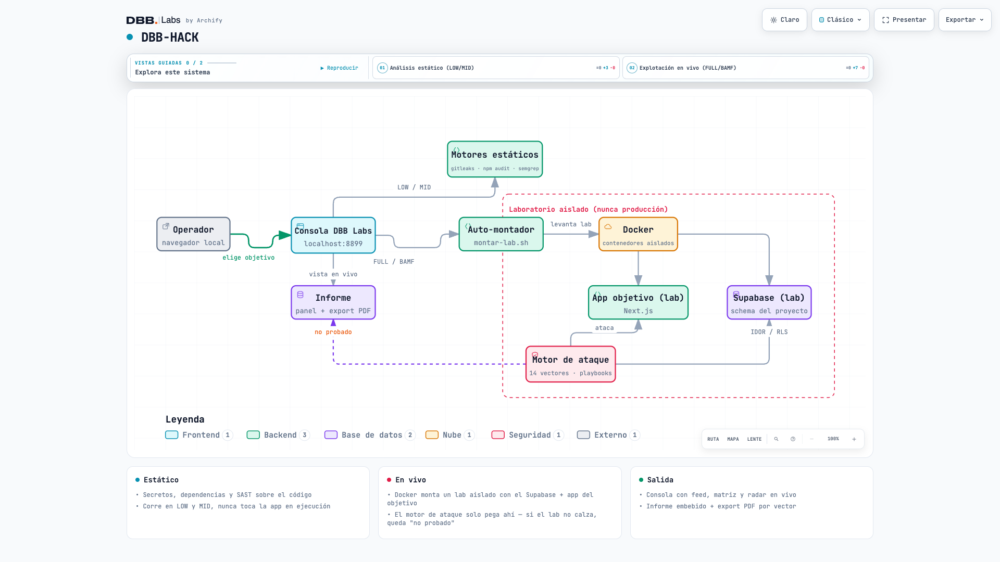

# DBB-HACK

**Tu propio pentester interno para apps Next.js + Supabase — gratis, open source, sin
pagar por token.** Nació después de quemar plata de verdad en una herramienta de pentest
con IA que se caía sola por los límites del proveedor.


*[Read in English](README.md) · Español*

> © 2026 Felipe Córdova · DBB Labs — Licencia **GNU AGPL-3.0** (ver `LICENSE`) + alcances
> legales chilenos. Herramienta ofensiva: uso solo sobre sistemas propios o autorizados
> por escrito.

## 🍺 CÓMPRAME UNA CERVEZA
### Si esto te ahorró plata en pentest, cómprame una cerveza
# 👉 **[buymeacoffee.com/DbbLabs](https://buymeacoffee.com/DbbLabs)** 👈

| 14 vectores | 4 niveles | 0 resultados inventados |
|---|---|---|
| estático + explotación en vivo | LOW → BAMF | "no probado" en vez de un hallazgo falso |

---

Pentester interno de DBB para apps **Next.js + Supabase**, con su propia **consola de
centro de comando (DBB Labs)**. Corre sobre Claude Code / herramientas locales — sin
pagar por token. Playbooks adaptados de Strix (Apache-2.0, ver `NOTICE`) y mapeados a
ISO 27002 / OWASP. Licencia: **GNU AGPL-3.0** (ver `LICENSE`), con alcances legales
chilenos anexos.

| | |
|---|---|
| [Qué hace](#qué-hace-hoy) | análisis estático + explotación en vivo + consola en vivo |
| [4 niveles](#4-niveles) | LOW, MID, FULL, BAMF — qué ataca cada uno |
| [Uso](#uso) | Docker + un comando |
| [Garantía de integridad](#garantía-de-integridad-regla-de-oro) | por qué nunca inventa un resultado |
| [Alcance genérico](#alcance-genérico) | qué corre en cualquier proyecto y qué necesita cuentas sembradas |
| [Límite honesto](#límite-honesto) | qué no es |
| [Tests](#tests) | la suite de la propia consola |

## Arquitectura



## Qué hace (hoy)
- **Análisis estático** del código: secretos (gitleaks), dependencias (npm audit), SAST (semgrep).
- **Explotación EN VIVO** en un **laboratorio local aislado**: monta el Supabase + la app
  del proyecto y lanza ataques reales (robo externo, IDOR/RLS, escalada, 2FA, webhook,
  crons, fuerza bruta, GraphQL, open redirect, enumeración, cabeceras).
- **Consola en vivo** (http://localhost:8899): panel de control, torta de progreso, feed,
  matriz de ataque, radar de postura, tabla de contenedores (docker stats real), informe
  embebido + export PDF, y un panel por vector con recomendación + prompt de remediación.

## 4 niveles

| Nivel | Hace |
|---|---|
| **LOW** | Solo estático: secretos, dependencias, SAST |
| **MID** | + revisión humana de los playbooks, sigue sin tocar la app en ejecución |
| **FULL** | + ataques en vivo en un laboratorio local aislado |
| **BAMF** | + ASVS/WSTG, flujos de dinero, mapa de cumplimiento |

Ver `niveles.md` y el catálogo `dashboard/vectores.json`.

## Uso

Necesitas **[Docker](https://www.docker.com/)** — el laboratorio corre en contenedores
aislados, nunca toca producción — y **[Claude Code](https://claude.com/claude-code)**
(gratis, corre local, por eso DBB-HACK no cobra por token).

```bash
git clone https://github.com/DBB-Labs/dbb-hack.git
cd dbb-hack
docker --version          # confirma que Docker está instalado y corriendo
bash dashboard/servir.sh  # abre la consola en http://localhost:8899
```

Elige objetivo (cualquier repo en `~/Documents/Proyectos`) + nivel + vectores, y LANZAR.
En FULL/BAMF el auto-montador (`montar-lab.sh`) levanta el lab del proyecto solo. Los
informes se guardan en `~/Documents/STRIX ANALISIS/<año>/<proyecto>/<mes>/`.

## Garantía de integridad (regla de oro)

**Nunca inventa resultados.** Si el lab del objetivo no está montado (el `project_id` no
calza) o la app no responde, los vectores en vivo quedan **"no probado"** — jamás un
vulnerable/hallazgo falso. Solo se ataca el lab del objetivo, nunca producción.

## Alcance genérico

Los vectores externos/estáticos (S1-S3, A0, A7, A8, A9, A10) corren en **cualquier**
proyecto Supabase+Next. Los específicos del esquema (A1/A2/A3: RLS, escalada, 2FA)
requieren cuentas sembradas con el esquema del proyecto; si no las hay → "no probado".

## Límite honesto

DBB-HACK **sí hace explotación en vivo** (en laboratorio aislado). Lo que **no** es: un
**pentest externo profesional acreditado** — su cobertura se limita a los vectores
implementados, no tiene la creatividad de un red team humano, corre en un lab local y no
reemplaza la auditoría independiente que exige un regulador (p.ej. CMF). Es una capa
fuerte, continua y gratuita; no el sello final de cumplimiento.

## Tests

`npm run test:e2e` — suite Playwright del flujo de la consola.
